# Reasonix 接入 Matrix Lab 的 AI 模型服务 · 使用教程

[返回手册目录](../../README.md)

> 适用对象：实验室新进成员。

> 目标：申请实验室统一发放的 AI Token 账号，并在 Reasonix 客户端中完成 API 配置，能够正常调用 DeepSeek / Qwen 等模型。

---

## 目录

1. [前置准备](#一前置准备)
2. [注册 MatrixLab AI 账号并申请额度](#二注册-matrixlab-ai-账号并申请额度)
3. [创建 API 密钥](#三创建-api-密钥)
4. [下载并安装 Reasonix](#四下载并安装-reasonix)
5. [在 Reasonix 中配置模型服务](#五在-reasonix-中配置模型服务)
6. [验证配置是否成功](#六验证配置是否成功)
7. [查看 API 调用日志](#七查看-api-调用日志)
8. [常见问题排查](#八常见问题排查)
9. [注意事项](#九注意事项)

---

## 一、前置准备

### 1.1 连接合肥工业大学校园网

实验室的 [MatrixLab AI](https://ai.matrix-lab.top/) **仅限校园网访问**（有线 / 无线均可）。

### 1.2 了解可用的模型与额度

实验室提供了 AI Token 账号，供科研使用。请根据个人研究方向和需求选择合适的模型。实验室目前提供如下模型：

   - **DeepSeek**：每月 20 元人民币额度

如需提升额度，请联系实验室管理员。

---

## 二、注册 MatrixLab AI 账号并申请额度

1. 确认已连接校园网后，进入实验室的 [MatrixLab AI](https://ai.matrix-lab.top/)。

2. 点击页面上的**注册**入口，按提示完成注册：

   - 使用**学校邮箱**注册，并完成**邮箱验证**；
   - 完善账号信息，**用户名必须填写本人真实姓名**，便于管理员核对身份后发放额度。

3. 注册并登录成功后，查看[申请流程](https://matrix-lab.top/matrixlab/join/)，创建对应工单（Issue），等待管理员审核。

4. 审核通过后，账号具备可用额度，可进入下一步创建密钥。

---

## 三、创建 API 密钥

### 3.1 进入仪表板

登录后会看到站点首页：

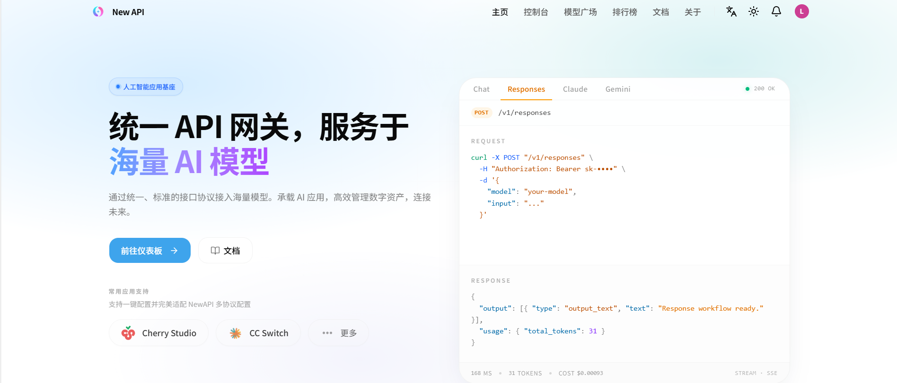

点击 **「前往仪表板」**。

### 3.2 打开仪表板概览

进入仪表板后可以看到「概览」页面，其中包含引导流程（创建 API 密钥 → 添加额度 → 发送请求）与用量、剩余额度等统计信息：

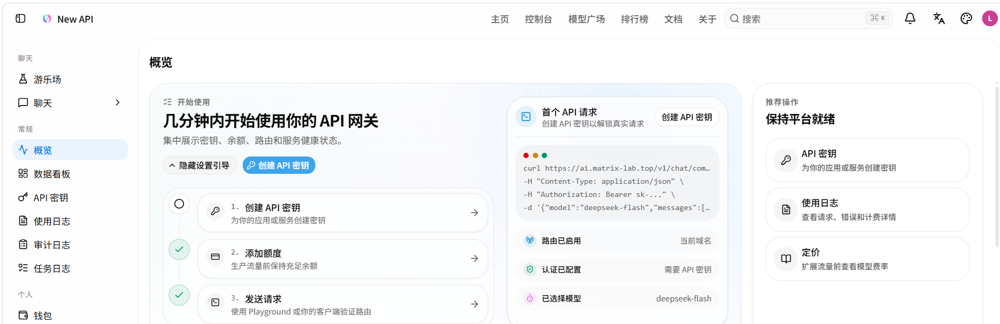

### 3.3 进入 API 密钥页面

在左侧菜单中点击 **「API 密钥」**（也可直接点击概览页的「创建 API 密钥」按钮）。初次进入时列表为空，提示「未找到 API 密钥」：

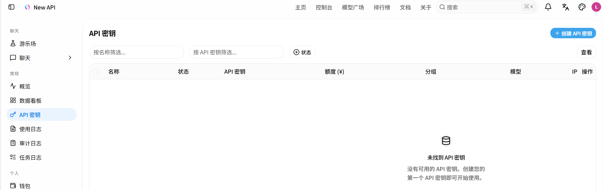

### 3.4 填写创建表单

点击页面右上角的 **「+ 创建 API 密钥」** 按钮，弹出创建窗口，按下表填写：

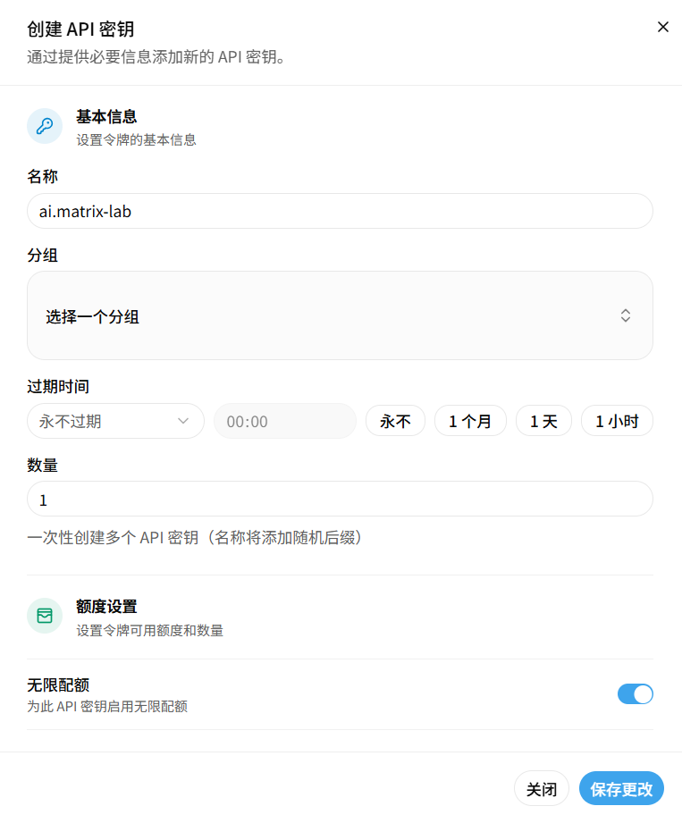

| 字段 | 填写内容 |
| --- | --- |
| 名称 | `ai.matrix-lab`（可自定义，**建议记为固定名称，后面配置 Reasonix 时要填一致**） |
| 分组 | 可留空（选择一个分组为可选） |
| 过期时间 | **永不过期** |
| 数量 | `1` |
| 无限配额 | 保持开启（由账号额度统一控制） |

确认无误后点击右下角 **「保存更改」**。

### 3.5 复制并保存密钥

创建完成后，列表中会出现刚才创建的密钥，状态为「已启用」，密钥以 `sk-xxxxx` 开头：

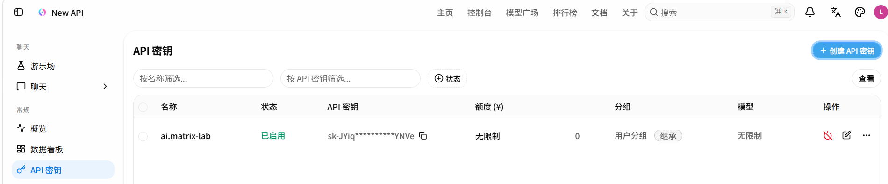

**务必立即复制并妥善保存完整密钥（`sk-xxxxx`）**：

- 点击密钥右侧的复制图标即可复制；
- 建议保存到本地密码管理器，不要放进 Git 仓库、公共群聊或截图外发。

---

## 四、下载并安装 Reasonix

### 4.1 Reasonix 简介

Reasonix 是一款免费开源的桌面端 AI 对话 / 编程助手，支持 Windows、macOS 和 Linux。

它本身不提供模型，而是一个「对话界面 + 连接工具」：通过填写实验室 MatrixLab AI 的地址和 API 密钥，就能在本地直接调用实验室发放的 DeepSeek、Qwen 等模型，无需打开网页，也无需任何编程基础。

对使用者而言，有两点需要牢记：

- **Reasonix 使用的是实验室统一发放的 AI Token 账号和额度，API 密钥即代表账号身份，严禁外传**；
- **配置只需完成一次**，按照本节步骤设置完毕后，以后每次打开 Reasonix 即可直接对话，无需重复配置。

### 4.2 下载安装包

1. 在浏览器访问[下载页](https://reasonix.io/?download=desktop#start)。

2. 页面会自动识别当前系统（示例为 Windows），**按自己电脑的系统进行下载**：

   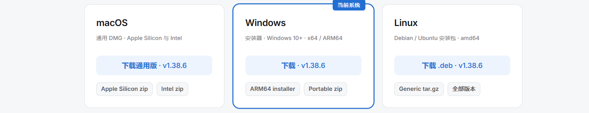

### 4.3 安装并首次启动

1. 下载完成后双击安装，安装完成后启动 Reasonix。

2. 首次打开 Reasonix，界面如下，顶部提示「开始对话前，请先连接一个模型服务。」，点击 **「配置模型服务」**：

   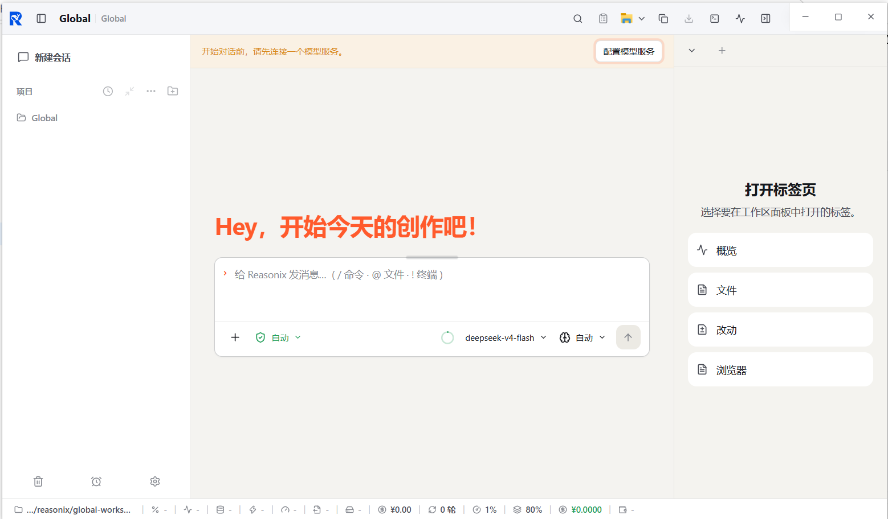

也可以稍后从 **设置 → 模型服务** 进入相同配置界面。

---

## 五、在 Reasonix 中配置模型服务

### 5.1 添加自定义供应商

在「模型服务」页面点击 **「添加供应商」**，切换到 **「自定义」** 页签，按下表填写：

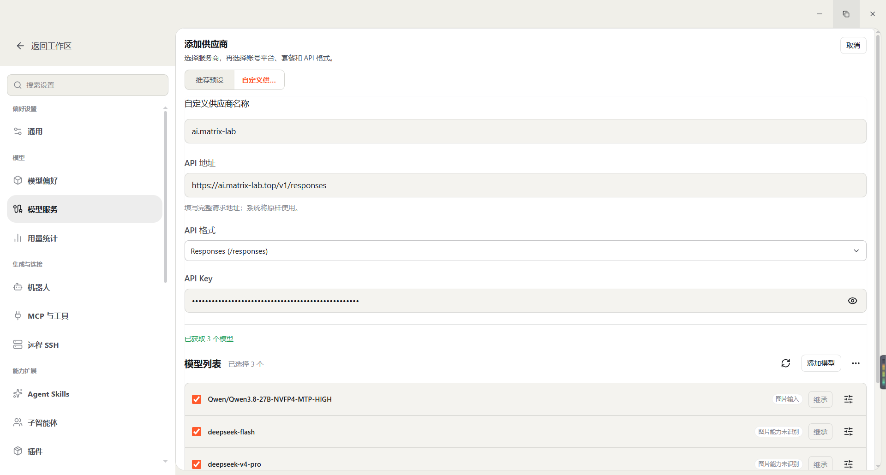

| 字段 | 填写内容 |
| --- | --- |
| 自定义供应商名称 | `ai.matrix-lab`（**必须与第三步创建 API 密钥时的名称保持一致**） |
| API 地址 | `https://ai.matrix-lab.top/v1/responses` |
| API 格式 | `Responses (/responses)` |
| API Key | 粘贴第三步保存的密钥（`sk-xxxxx` 开头） |

填写 API 地址时注意：

- 必须填写**完整的请求地址**，以 `/v1/responses` 结尾，不要只填到域名；
- 不要有多余空格或换行。

API Key 输入框默认隐藏字符，可点击右侧 👁 图标核对是否粘贴完整。

### 5.2 选择模型

填写完成后，页面会提示「已获取 N 个模型」，勾选**全部模型**（示例为 3 个）：

- `Qwen/Qwen3.8-27B-NVFP4-MTP-HIGH`
- `deepseek-flash`
- `deepseek-v4-pro`

### 5.3 为 Qwen 模型开启图片识别（可选）

如果要做**图片 / 截图识别**，请为 Qwen 模型开启图片输入能力（DeepSeek模型同理）：

1. 点击 Qwen 模型右侧的 **「⋮」→ 编辑模型**；
2. 在「模型能力 → 输入」中，勾选 **图片**。
3. 点击 **「应用更改」**。

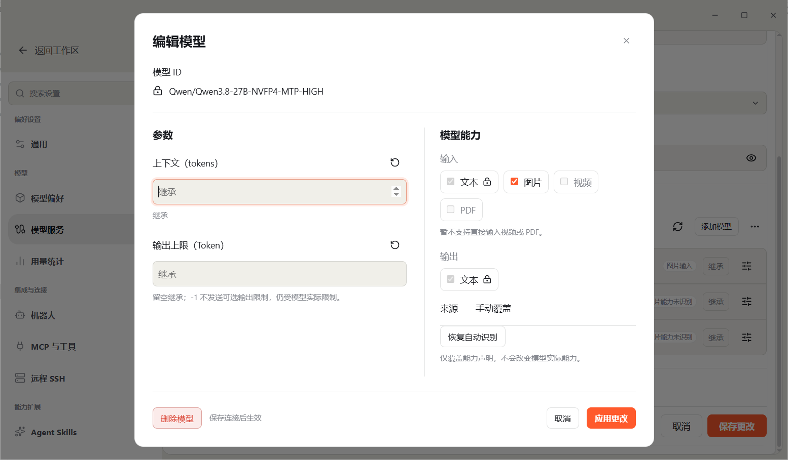

### 5.4 保存配置

返回模型服务页面，点击底部的 **「保存更改」**：

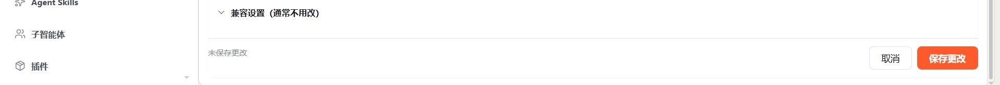

保存后，主页输入框下方的模型选择器即可看到已配置的模型（如 `deepseek-flash`）。

---

## 六、验证配置是否成功

1. 回到 Reasonix 主界面，点击 **「新建会话」**；
2. 在底部确认已选中一个模型（如 `deepseek-flash`）；
3. 发送一条测试消息，例如：

   ```text
   你是什么模型？
   ```

4. 若模型正常返回内容，说明连接成功：

   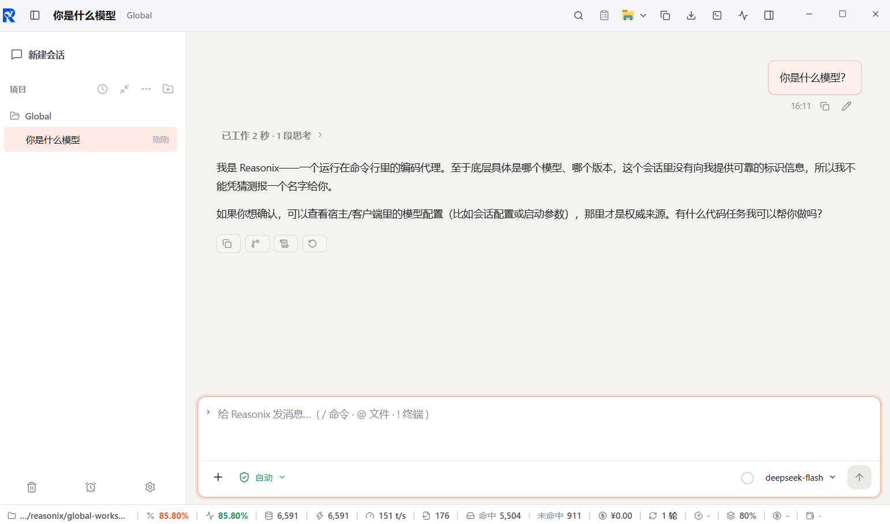

此时底部状态栏会显示 Token 消耗、命中率等运行指标，可据此确认是否已真正连上 API。

---

## 七、查看 API 调用日志

想确认调用记录、Token 消耗与费用，可回到 MatrixLab AI 查看日志：

1. 访问 [MatrixLab AI](https://ai.matrix-lab.top/)并登录；
2. 左侧菜单 → **「使用日志」**；
3. 可按时间范围、模型名称、分组、类型筛选，点击「搜索」查看。

日志中包含时间、密钥名称（令牌）、模型、Tokens、费用、耗时等信息：

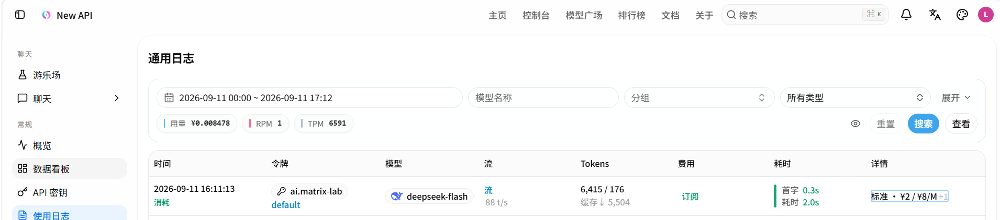

**对账小技巧**：如果日志里没有新增记录，说明请求失败——优先检查校园网连接、API 地址是否填写完整、API 格式是否选择了 `Responses`。

---

## 八、常见问题排查

| 现象 | 可能原因 | 解决办法 |
| --- | --- | --- |
| 打不开 [MatrixLab AI](https://ai.matrix-lab.top/) | 未连接校园网 | 连接校园网后重试 |
| 找不到注册入口 / 收不到验证邮件 | 使用了非学校邮箱 | 改用学校邮箱注册，检查垃圾邮件目录 |
| 没有额度、模型不可用 | 工单未提交或未通过审核 | 提交工单联系实验室管理员审核 |
| Reasonix 里模型列表拉取为空 | API 地址或格式填错 | 地址须为 `https://ai.matrix-lab.top/v1/responses`，格式选 `Responses (/responses)` |
| 提示密钥无效 / 未授权 | 密钥复制不完整、含空格，或已删除 | 回到「API 密钥」页核对状态，必要时重新创建密钥 |
| 对话无响应、一直转圈 | 网络不通或额度用尽 | 检查校园网；在仪表盘「概览 / 使用日志」确认剩余额度与请求记录 |
| Qwen 模型无法识图 | 未开启图片输入能力 | 编辑模型 → 模型能力 → 勾选「图片」→ 应用更改 |
| 密钥疑似泄露 | 密钥外发到公开渠道 | 在「API 密钥」页删除该密钥并重新创建 |

---

## 九、注意事项

- **密钥即身份**：密钥代表你的账号额度，请勿共享、外发或提交到代码仓库。一旦泄露，立即删除并重建。
- **额度管理**：DeepSeek 每月 20 元人民币额度，用完后可联系管理员提额。建议在「使用日志」中定期关注消耗。
- **命名保持一致**：Reasonix 中的「自定义供应商名称」与站点「API 密钥名称」保持同名，便于日志对账与后续排查。
- **仅限科研用途**：模型服务供实验室科研使用，请遵守学校及实验室的相关规定。

---

*如遇本文档未覆盖的问题，请携带错误截图（记得给密钥打码）联系实验室管理员。*
